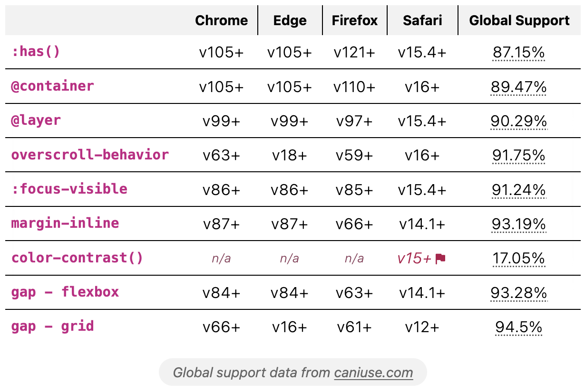

## Eleventy Plugin: CSS Browser Support

> Eleventy filters for decorating inline-code with CSS broswer support data or rendering support tables. Data combined from caniuse and MDN, including version support started and global support percentages.

Plugin provides three filters, giving the option for rendering full support tables or turning inline code into buttons to trigger a popover panel.




**Panel JavaScript** is optionally included with the following features:

- toggling panels open and close
- closing upon `Escape` and `Tab` or click outside the panel
- closing open panels when another is toggled
- preventing overflow collision with the viewport (requires coordination with panel styles)

> **Note** - due to inlining of this JS, it can appear to not work with Eleventy v1.0.1+ hot-reloading. A manual refresh may be required.

**Styles** are not provided, see the [styling section](#styling-the-panels-and-tables) for example structure and stylesheet.

## Usage

Install the plugin:

```bash
npm install @11tyrocks/eleventy-plugin-css-browser-support
```

Then, include it in your `.eleventy.js` config file:

```js
const cssBrowserSupport = require("@11tyrocks/eleventy-plugin-css-browser-support");

module.exports = (eleventyConfig) => {
  eleventyConfig.addPlugin(cssBrowserSupport);
};
```

## Filter Setup

If you plan to use the inline code filter to produce collapsible panels, be sure to add the `cssSupportPanels` filter in your main template that outputs the final content, example:

```twig
{{ content | cssSupportPanels | safe }}
```

Then, each time you want to render a support panel, replace inline code blocks with the `cssSupport` filter:

```twig
{{ 'aspect-ratio' | cssSupport }}
```

You can also include a value, in which case only the property will be queried for support, such as the following will show `margin-inline` support:

```twig
{{ 'margin-inline: auto' | cssSupport }}
```

> **Note** a panel will only be generated and attached for the first instance of a duplicate property used within the same template.

Alternatively, render a full table showing support for one or more things, example:

```twig

```

## Supported CSS features

The API is intended to work for passing features as you would write them in CSS. As such, a few things will not be available if they exist on MDN under an expanded name. For example, `>` would be available as `child`.

Additionally, some features are nested and may be missed by the API. Exceptions are grid features (ex. `repeat()`), and color types (ex. `color-contrast()`) which have been explicitly included.

Review the data from MDN:

- [at-rules](https://github.com/mdn/browser-compat-data/tree/main/css/at-rules)
- [properties](https://github.com/mdn/browser-compat-data/tree/main/css/properties)
- [selectors](https://github.com/mdn/browser-compat-data/tree/main/css/selectors)
- [types](https://github.com/mdn/browser-compat-data/tree/main/css/types)

## Styling the panels and tables

This plugin is BYOS (bring your own style) but you can check out [the stylesheet included in the repo](_includes/assets/style.css) to produce the styles shown in the intro.

- `pointer-events: none` is added inline to the code and SVG icon
- it's recommended to use a pseudo-element to extend the "hit area" of the button to cover the code element

### Panel HTML

<details>
<summary>View panel HTML</summary>

```html
<span class="css-support-panel-container">
  <code style="pointer-events: none;">aspect-ratio</code>
  <button
    type="button"
    class="css-support-button"
    aria-label="Browser support for aspect-ratio"
    aria-expanded="false"
    aria-controls="css-support-aspect-ratio"
  >
    <svg
      xmlns="http://www.w3.org/2000/svg"
      aria-hidden="true"
      class="css-support-icon"
      viewBox="0 0 24 24"
      width="24"
      height="24"
      style="pointer-events: none"
    >
      <path
        fill="currentColor"
        d="M7 17h2v-7H7Zm4 0h2V7h-2Zm4 0h2v-4h-2ZM5 21q-.8 0-1.4-.6Q3 19.8 3 19V5q0-.8.6-1.4Q4.2 3 5 3h14q.8 0 1.4.6.6.6.6 1.4v14q0 .8-.6 1.4-.6.6-1.4.6Z"
      ></path>
    </svg>
  </button>
  <div hidden id="css-support-aspect-ratio" class="css-support-panel">
    <div class="css-support-panel-table-container">
      <table class="css-support-table">
        <caption>
          Browser support for
          <code>aspect-ratio</code>
        </caption>
        <thead>
          <tr>
            <th>Chrome</th>
          </tr>
        </thead>
        <tbody>
          <tr>
            <td>v88+</td>
          </tr>
        </tbody>
      </table>
    </div>
    <small>
      <em>Global <code>aspect-ratio</code> support:</em> 86.49%<br />
      <a href="https://caniuse.com/?search=aspect-ratio">
        caniuse data for aspect-ratio
      </a>
    </small>
  </div>
</span>
```

</details>

### Table HTML

<details>
<summary>View table HTML</summary>

```html
<div class="css-support-table-container">
  <table class="css-support-table">
    <thead>
      <tr>
        <td></td>
        <th>Chrome</th>
      </tr>
    </thead>
    <tbody>
      <tr>
        <th><code>text-underline-offset</code></th>
        <td>v87</td>
        <td>
          <a href="https://caniuse.com/?search=text-underline-offset">90.61%</a>
        </td>
      </tr>
    </tbody>
  </table>
  <p>Global support data from <a href="https://caniuse.com/">caniuse.com</a></p>
</div>
```

</details>

### Special case: Panel alignment

The JS will add extra classes depending on the size of the viewport and it the panel is at risk of overflow. You may need to adjust the panel position styles accordingly.

Alignment classes:

- `.css-support-panel--left` - added when the panel should align to the left side of the trigger button
- `.css-support-panel--right` - added when the panel should align to the right side of the trigger button

## Config Options

| Option         | Type  | Default                                 |
| -------------- | ----- | --------------------------------------- |
| browserList    | array | ["chrome", "edge", "firefox", "safari"] |
| showPanelTable | bool  | true                                    |
| includePanelJS | bool  | true                                    |

## Config Examples

### Change list of browsers displayed

> **Note** All available browsers are queried to get an accurate global support percentage.

The following array shows the complete list of valid `browserList` options.

```js
[
  "chrome",
  "chrome_android",
  "edge",
  "firefox",
  "firefox_android",
  "ie",
  "opera",
  "safari",
  "safari_ios",
  "samsunginternet_android",
];
```

**Example: Add Safari on iOS**

```js
eleventyConfig.addPlugin(cssBrowserSupport, {
  browserList: ["chrome", "edge", "firefox", "safari", "safari_ios"],
});
```

### Remove support table from panels

To only show global percentage and caniuse link in the popover panel, use `showPanelTable: false`

```js
eleventyConfig.addPlugin(cssBrowserSupport, {
  showPanelTable: false,
});
```

### Prevent output of panel javascript

If you'd like to write your own JS or include it in another way, you can disable the automatic inclusion with `includePanelJS: false`

```js
eleventyConfig.addPlugin(cssBrowserSupport, {
  includePanelJS: false,
});
```

## Credits

This plugin relies on my package [css-browser-support](https://www.npmjs.com/package/css-browser-support) which returns the support data from MDN and global percentage from caniuse.
